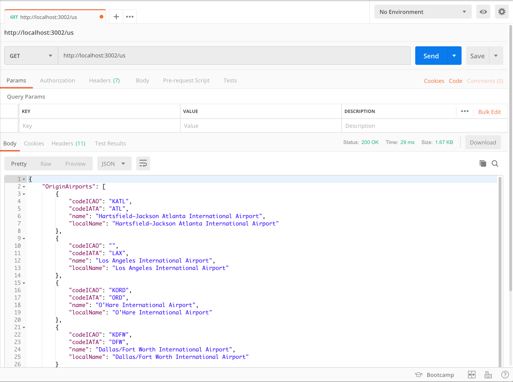

# Countries API web service

This directory contains a simple web service _(based on `hapi` framework)_ which returns a list of origin/destination airports for a particular country.

## Set up and run the service

First, let's install all dependencies by running:

```sh
npm run install
```

If all packages have been installed succesfully, let's start the service by running:

```sh
npm start
```

Our service should be running locally and listening on port `3002`.

Let's open Postman and see if it returns correct response. **(Remember to add countryCode like `ar`, `pl` or `us` as a URL parameter)**



<style>
  img {border: 1px solid rgb(0,0,0)}
</style>
