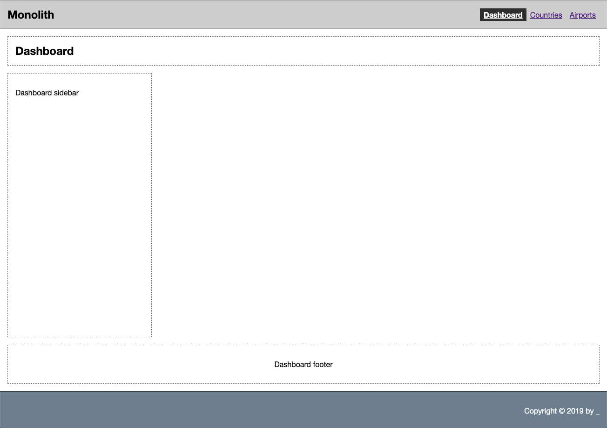
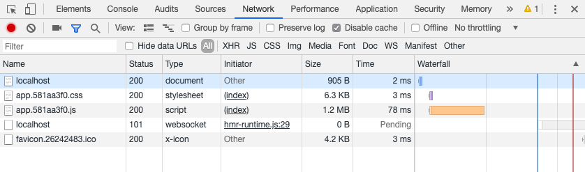

# Monolith application

This is a simple, yet monolith application build to illustrate how to create a modern single-page application (SPA) based on React _(^16.8&mdash;the one with hooks)_.

## Application screen (or route) structure

* `/` &mdash; Dashboard
* `/countries` &mdash; Countries
* `/airports` &mdash; Airports

## Set-up

Let's install dependencies first. Inside this directory ('monolith'), run this command:

```sh
npm run install
```

## Running the application

I decided to use `parcel-builder` to build/serve this application. I didn't want to spend time configuring `webpack` or any other bundler and opted for a "zero-configuration" approach. _(We'll see later what this approach leads to.)_

To start the application _(remember to start API services, first)_, run:

```sh
npm start
```

You should see an open browser or tab with our Monolith application running locally on port `4000`. Open Developer Tools and the Network Tab and hit Refresh button&mdash;you should see our application Dashboard with a few rendered placeholder areas.



If you focus on the Network tab, you will see that we loaded the whole application with all styles, event though we have not yet used any other parts of the application.



If you click on JS bundle we produced, `app.[hash].js` you might notice that it contains all the plumbing from `parcel-bundler` required to serve our app plus all of our application dependencies and finally all its modules transpiled into about 1.2MB of ECMA5 code!

One positive aspect of this setup is that if users navigate to other screens, like Countries or Airports, they won't incur the penalty of loading another JS/CSS bundles. They, of course, have to load our entire application up front. Depending on the size of an application, this might be desirable or detrimental.

<style>
  img {border: 1px solid rgb(0,0,0)}
</style>
