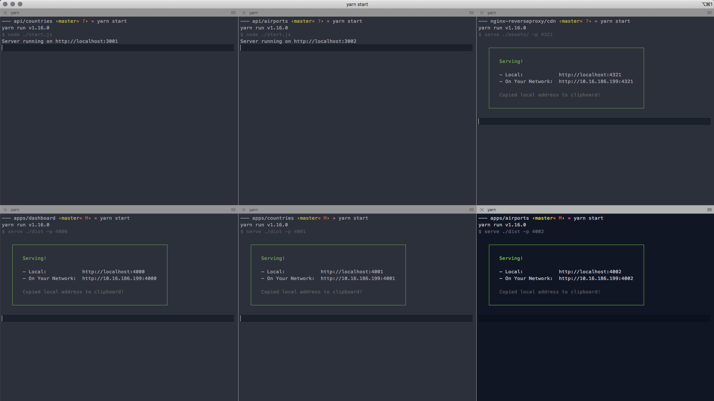

# Microfrontends (with Nginx as reverse proxy)

## 1. Getting Started

Before doing anything it would be very helpful to use either a tabbed or split-window Terminal/Console app (if you have a large screen) because we will need to operate on **SIX** _separate_ directories:

1. API web service returning countries (`cd ../api/countries`)
2. API web service returning country airports (`cd ../api/airports`)
3. Web server hosting shared libraries and global stylesheet (`cd ./cdn`)
4. Web server hosting the **Dashboard** app (`cd ./apps/dashboard`)
5. Web server hosting the **Countries** app (`cd ./apps/countries`)
6. Web server hosting the **Airports** app (`cd ./apps/airports`)



Once we change into respective directories (listed above,) the next thing is to install dependencies for each separate unit by running:

```sh
yarn
```

inside each directory. If you use `npm` instead of `yarn`, simply run:

```sh
npm install
```

### 1.1. Running/building/starting each service/app

To start API/CDN services, you don't need to build anything. In `../api/countries`, `../api/airports` and `./cdn` directories simple run:

```sh
yarn start
```

Each local web server will start listening for requests on a different port.

- **http://localhost:3001**&mdash;Countries API service
- **http://localhost:3002**&mdash;Airports API service
- **http://localhost:4321**&mdash;CDN service

Next, lets build/start our applications.

In each directory: `./apps/dashboard`, `./apps/countries` and `./apps/airports`, run:

```sh
yarn run build
```

and then, after each succesful build, run:

```sh
yarn start
```

Each application should now be served locally on its own port:

- **http://localhost:4000**&mdash;Dashboard
- **http://localhost:4001**&mdash;Countries
- **http://localhost:4002**&mdash;Airports

### 1.2. Use Nginx as a Reverse Proxy

A reverse proxy is an intermediary proxy service which takes a client request, passes it on to one or more servers, and subsequently delivers the server’s response to the client.

Though our services and apps are running now separately on different ports, we would like it appear to users that our application, composed of individual micro frontends, is unified under one base URL and acts like a single, monolithic web application.

**We assume that you have Nginx istalled already.** There is a configuration file in `./nginx` directory with a set of directives to enable Nginx to act as a reverse proxy. Simply copy them to your default configuration and restart the server.

A sample `/usr/local/etc/nginx/default.conf` file might look like this:

```conf

worker_processes  1;

events {
    worker_connections  1024;
}


http {
    include       mime.types;
    default_type  application/octet-stream;

    sendfile        on;

    keepalive_timeout  65;

    gzip  on;

    server {
        listen       80;
        server_name  localhost;

        charset utf-8;

        ssi on;
        proxy_intercept_errors on;

        location /static/ {
          proxy_set_header Host $host;
          proxy_set_header X-Real-IP $remote_addr;
          proxy_set_header X-Forwarded-For $proxy_add_x_forwarded_for;
          proxy_set_header X-Forwarded-Proto $scheme;
          proxy_pass http://localhost:4321/;
        }

        location /api/countries/ {
          proxy_set_header Host $host;
          proxy_set_header X-Real-IP $remote_addr;
          proxy_set_header X-Forwarded-For $proxy_add_x_forwarded_for;
          proxy_set_header X-Forwarded-Proto $scheme;
          proxy_pass http://localhost:3001/;
        }

        location /api/airports/ {
          proxy_set_header Host $host;
          proxy_set_header X-Real-IP $remote_addr;
          proxy_set_header X-Forwarded-For $proxy_add_x_forwarded_for;
          proxy_set_header X-Forwarded-Proto $scheme;
          proxy_pass http://localhost:3002/;
        }

        location /countries/ {
          proxy_set_header Host $host;
          proxy_set_header X-Real-IP $remote_addr;
          proxy_set_header X-Forwarded-For $proxy_add_x_forwarded_for;
          proxy_set_header X-Forwarded-Proto $scheme;
          proxy_pass http://localhost:4001/;
        }

        location /airports/ {
          proxy_set_header Host $host;
          proxy_set_header X-Real-IP $remote_addr;
          proxy_set_header X-Forwarded-For $proxy_add_x_forwarded_for;
          proxy_set_header X-Forwarded-Proto $scheme;
          proxy_pass http://localhost:4002/;
        }

        location / {
          proxy_set_header Host $host;
          proxy_set_header X-Real-IP $remote_addr;
          proxy_set_header X-Forwarded-For $proxy_add_x_forwarded_for;
          proxy_set_header X-Forwarded-Proto $scheme;
          proxy_pass  http://localhost:4000/;
        }
    }

    include servers/*;
}


```

## 2. Application Characteristics

- There is no parent or root router; switching between "applications" results in a complete request/response cycle and a full screen render (including Header/Footer) without a smooth transition.
- `<Header />`, `<Footer />` and any other common components need to be extracted into a shared library and imported into each app from a node module package (`@mf/shared-components`).
- History (back button) is broken
