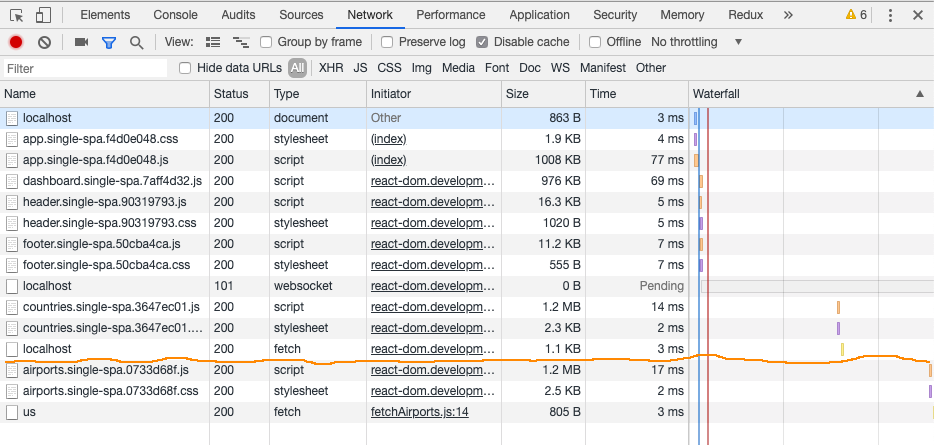

# Microfrontends made easy... really? :)

## Single-SPA-1

Built with `parcel-bundler` (and `postcss`)

---

This is a simple build to illustrate how to create an application composed of multiple "micro" apps based on `react` _(^16.8&mdash;the one with hooks)_ and [`single-spa`](https://single-spa.js.org/) package.

### Application structure

You might notice that our application is broken into separate directories:

- `airports`
- `app`
- `countries`
- `dashboard`

which correspond with its routing:

- `/`&mdash;Dashboard
- `/countries`&mdash;Countries
- `/airports`&mdash;Airports

You will notice that `app` directory is not one of the routes. In fact, `app` directory contains app components, like `Header` and `Footer` as well as a module `app.single-spa.js`.

This module registers **dashboard**, **countries**, **airports** along with `Header` and `Footer` components (contained in **app**) as separate "micro" apps and acts as a starting point and an orchestrator for our application.

```js
import { registerApplication, start } from 'single-spa'

import './src/css/app.css'
import './src/css/app-layout.css'

const commonProps = {
  prop1: 'Prop #1',
  prop2: 'Prop #2'
}

registerApplication(
  'dashboard',
  () => import('../dashboard/src/dashboard.single-spa.js'),
  location =>
    location.pathname === '' ||
    location.pathname === '/' ||
    location.pathname.startsWith('/dashboard'),
  commonProps
)

registerApplication(
  'countries',
  () => import('../countries/src/countries.single-spa.js'),
  location => location.pathname.startsWith('/countries'),
  commonProps
)

registerApplication(
  'airports',
  () => import('../airports/src/airports.single-spa.js'),
  location => location.pathname.startsWith('/airports'),
  commonProps
)

registerApplication(
  'header',
  () => import('./src/header/header.single-spa.js'),
  () => true
)

registerApplication(
  'footer',
  () => import('./src/footer/footer.single-spa.js'),
  () => true
)

start()
```

See documentation for [registerApplication](https://single-spa.js.org/docs/api.html#registerapplication) to see how it can be used to register individual apps.

If you look carefully, you will notice that we passed a few common props to some of our registered applications. This way we could apss some common information like authorization tokens, session information, cookies, configuration, etc.

### Running the application

First, let's make sure that all dependencies have been installed by running `npm run install` **inside each** of our separate application directories. (It is very helpful to use a tabbed terminal application to run this command in each directory.)

Assuming there were no errors, let's start our application:

```sh
cd ../app
npm start
```

This command tells `parcel` to serve `/public/index.html` on port `5001` which loads `app.single-spa.js` script we mentioned earlier.

If you take a look at the HTML structure of `app/public/index.html` you will see that our microapps are mounted not at `#app-shell` DOM element, like in our Monolith application, but there are separate DOM nodes used to mount them individually and when they are needed.

```html
<body>
  <div id="app">
    <header id="app--header"></header>
    <main id="app--main"></main>
    <footer id="app--footer"></footer>
  </div>
  <script type="text/javascript" src="../app.single-spa.js"></script>
</body>
```

Our **dashboard**, **countries** and **airports** are mounted on demand at `#app-main` node. (We preserved the structure and `id` attributes to "reuse" the stylesheets we wrote for our Monolith application, but they could obviously be changed to what fits your needs.)

Each "micro" app contains a module which registers it with `single-spa` framework where you can define at what node it should be mounted. Let's take a look "Header" app (remember it is more than a component now) and its `app/src/header/header.single-spa.js` registration module:

```js
import React from 'react'
import ReactDOM from 'react-dom'
import singleSpaReact from 'single-spa-react'

import Header from './Header'

const lifecycles = singleSpaReact({
  React,
  ReactDOM,
  rootComponent: Header,
  domElementGetter: () => document.getElementById('app--header')
})

export const bootstrap = [lifecycles.bootstrap]

export const mount = [lifecycles.mount]

export const unmount = [lifecycles.unmount]
```

If you open the Developer Tools and take a look at the Network Tab (refresh the application to restart recording) you will notice that our application loaded only necessary modules and stylesheets to render the Dashboard.


Now if you navigate to the Countries screen you will notice that we only loaded countries module and stylesheet, and made a network request to fetch a list of countries.


Next, let's navigate to the Airports screen. Again, we only loaded the app (module/stylesheet) we requested.



Going back and forth between screens will not load anything (except make network request if necessary) because all "micro" apps which compose our application have already been loaded. They don't unload unless we close the browser tab under which our application runs (or [unload them](https://single-spa.js.org/docs/api.html#unloadapplication) because we want/need to.)

## Running individual apps separately

Our `single-spa`-powered application loads and mounts our separate apps under http://localhost:5001 URL.

However, each application could also be run separately if only to verify that it still functions properly on its own and that any requests to APIs that it makes still return sucessfully.

_We could even verify that any calls to other apps are working. It was beyond scope of this little exercise to set up this message or event bus._

To start each app on its own, run:

```sh
cd ../dashboard && npm start
cd ../countries && npm start
cd ../airports && npm start
```

Now each application should be running on its own port.

- **Dashboard** (http://localhost:5002)
- **Countries** (http://localhost:5003)
- **Airports** (http://localhost:5004)
